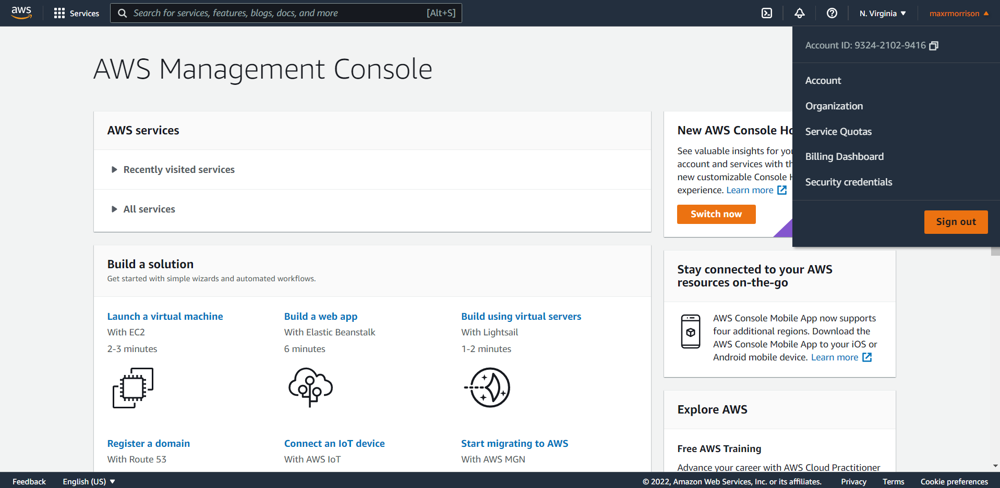
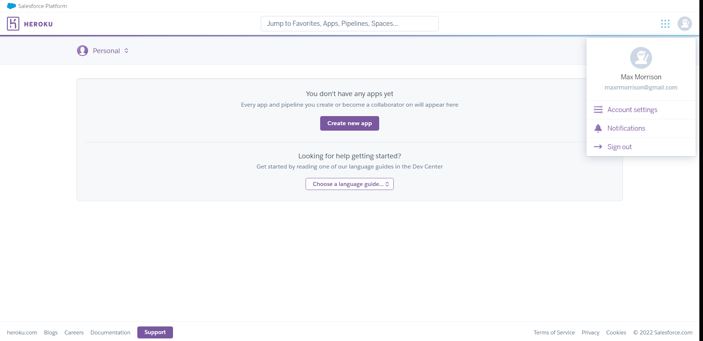
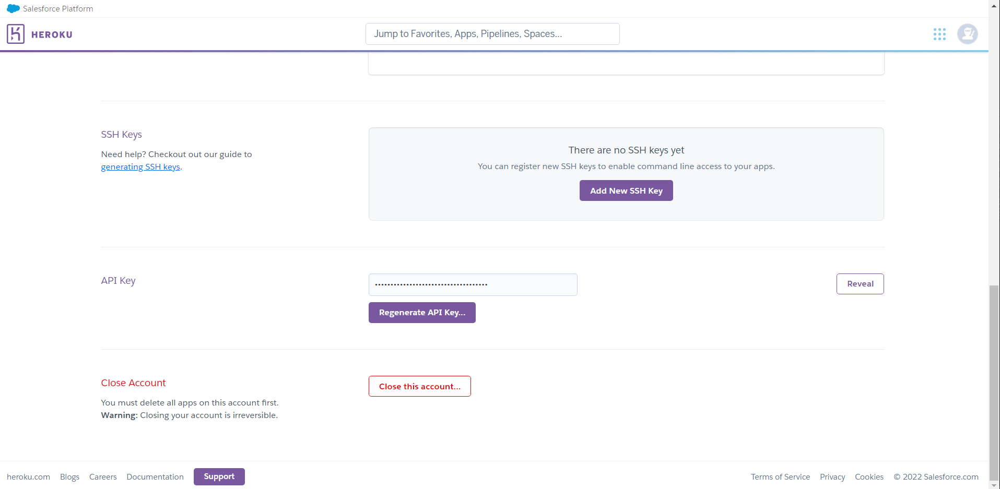

<h1 align="center">Reproducible Subjective Evaluation (ReSEval)</h1>
<div align="center">

[](https://pypi.python.org/pypi/reseval)
[](https://opensource.org/licenses/MIT)
[](https://www.python.org/downloads/)
[](https://pepy.tech/project/reseval)

</div>

ReSEval is a framework for quickly building subjective evaluation and
annotation tasks that are deployed on crowdworker platforms like
[Amazon Mechanical Turk](https://www.mturk.com/). ReSEval currently supports
A/B, ABX, MOS, MUSHRA, and Word Selection tests on audio, image, text, and video data.

<h3 align="center">
    While our code is free to use, performing crowdsourced subjective
    evaluation is not free.<br/>We are not responsible for costs incurred
    while using our code.
</h3>


### Citation

If you use ReSEval in an academic publication, please cite
[our paper](https://www.maxrmorrison.com/pdfs/morrison2022reproducible.pdf).


### IEEE

M. Morrison, B. Tang, G. Tan, and B. Pardo, "Reproducible Subjective Evaluation," ICLR Workshop on ML Evaluation Standards, April 2022.


### BibTex

```
@inproceedings{morrison2022reproducible,
    title={Reproducible Subjective Evaluation},
    author={Morrison, Max and Tang, Brian and Tan, Gefei and Pardo, Bryan},
    booktitle={ICLR Workshop on ML Evaluation Standards},
    month={April},
    year={2022}
}
```


## Table of contents
- [Installation](#installation)
    * [Deploying locally](#deploying-locally)
- [Configuration](#configuration)
- [Adding files](#adding-files)
    * [AB](#ab)
    * [ABX](#abx)
    * [MOS](#mos)
    * [MUSHRA](#mushra)
    * [WordSelect](#wordselect)
- [Credentials](#credentials)
    * [Heroku](#heroku)
    * [Amazon Web Services](#amazon-web-services)
    * [Amazon Mechanical Turk](#amazon-mechanical-turk)
- [Usage](#usage)
    * [Command-line interface](#command-line-interface)
        * [Create](#create)
        * [Monitor](#monitor)
        * [Results](#results)
        * [Pay](#pay)
        * [Destroy](#destroy)
        * [Extend](#extend)
    * [Application programming interface](#application-programming-interface)
- [Advanced usage](#advanced-usage)
    * [CLI](#cli)
    * [API](#api)
- [Additional monitoring](#additional-monitoring)


## Installation

First, install the Python module. ReSEval requires Python 3.9 or higher.

`pip install reseval`

Next, [download Node.js](https://nodejs.org/en/). You can check that your installation is correct by running `node --version`. ReSEval uses Node.js version 18.16.1 and is not guaranteed to work on all versions. If needed, Linux and OS X users can use `n` to change their version of Node.js, and Windows users can use [NVM for Windows](https://github.com/coreybutler/nvm-windows).

```
# Linux or OS X
sudo npm install -g n
sudo n 18.16.1

# Windows
# Must be run with administrator privileges
nvm install 18.16.1
nvm use 18.16.1
```

**Note** - You must restart your terminal after changing versions of node for the change to take effect

### Deploying locally

To be able to preview your subjective evaluation locally, you must
[setup a local MySQL database server](https://dev.mysql.com/doc/mysql-getting-started/en/)
and create a user with database creation privileges.

```bash
# Linux installation
sudo apt install mysql-server

# MySQL setup
sudo mysql_secure_installation

# Login to MySQL as root
sudo mysql -u root
```

```sql
-- Create a user (change new_user and new_password)
mysql> CREATE USER 'new_user'@'localhost' IDENTIFIED BY 'new_password';

-- Give user database creation privileges
mysql> GRANT ALL PRIVILEGES ON * . * TO 'new_user'@'localhost';
```

Run the following to store the username and password in
`reseval.CACHE / '.env'`.

```bash
python -m reseval.credentials \
    --mysql_local_user <mysql_user> \
    --mysql_local_password <mysql_local_password>
```

The `.env` file is used to set local environment variables and is not pushed to
GitHub or uploaded to any remote storage.


## Configuration

All configuration is performed in a YAML configuration file. See `examples/*.yaml` for examples and documentation of parameters.


## Adding files

The files to be evaluated must be organized in a directory structure according
to the type of test being run. The directory structures for each test are as
follows. Examples of valid directories of evaluation files can be found in
`examples/`.


### AB

```
ab
├── <condition-1>
│   ├── <file-0>
│   ├── <file-1>
│   ├── <file-2>
│   ├── ...
├── <condition-2>
│   ├── <file-0>
│   ├── <file-1>
│   ├── <file-2>
│   ├── ...
```


### ABX

```
abx
└── reference
│   ├── <file-0>
│   ├── <file-1>
│   ├── <file-2>
│   ├── ...
├── <condition-1>
│   ├── <file-0>
│   ├── <file-1>
│   ├── <file-2>
│   ├── ...
├── <condition-2>
│   ├── <file-0>
│   ├── <file-1>
│   ├── <file-2>
│   ├── ...
```


### MOS

```
mos
├── <condition-0>
│   ├── <file-0>
│   ├── <file-1>
│   ├── <file-2>
│   ├── ...
├── <condition-1>
│   ├── <file-0>
│   ├── <file-1>
│   ├── <file-2>
│   ├── ...
├── <condition-2>
│   ├── <file-0>
│   ├── <file-1>
│   ├── <file-2>
│   ├── ...
├── <condition-3>
│   ├── <file-0>
│   ├── <file-1>
│   ├── <file-2>
│   ├── ...
└── ...
```


### MUSHRA

```
mushra
├── <condition-0>
│   ├── <file-0>
│   ├── <file-1>
│   ├── <file-2>
│   ├── ...
├── <condition-1>
│   ├── <file-0>
│   ├── <file-1>
│   ├── <file-2>
│   ├── ...
├── <condition-2>
│   ├── <file-0>
│   ├── <file-1>
│   ├── <file-2>
│   ├── ...
├── <condition-3>
│   ├── <file-0>
│   ├── <file-1>
│   ├── <file-2>
│   ├── ...
└── ...
```


### WordSelect

```
wordselect
├── <file-0>
├── <words-0>
├── <file-1>
├── <words-1>
├── <file-2>
├── <words-2>
├── ...
```

`<words-x>` is `<file-x>` with `-words.txt` extension.


## Credentials

API keys are required to use the third-party services that ReSEval depends on.
These are not required for local development. Do not share these API keys.


### Amazon Web Services

Sign up for an AWS account. Go to `Security Credentials`. Under `Access keys`, click `Create New Access Key`.

<p align="center">
    
    
</p>

Note that this gives you a root access key. You can alternatively use the Identity & Access Management (IAM) system to setup more restrictive permissions for a user.

If you have never used AWS Elastic Beanstalk, one more step is required. Elastic Beanstalk instances created from Python (as opposed to the AWS console) do not instantiate the default instance profile IAM role. The solution is to either create (and then delete) an Elastic Beanstalk instance from the console, or to create the required IAM role manually. The IAM role is called `aws-elasticbeanstalk-ec2-role` and contains three permissions: (1) `AWSElasticBeanstalkWebTier`, (2) `AWSElasticBeanstalkMulticontainerDocker`, and (3) `AWSElasticBeanstalkWorkerTier`.


### Amazon Mechanical Turk

Follow the instructions [here](https://docs.aws.amazon.com/AWSMechTurk/latest/AWSMechanicalTurkGettingStartedGuide/SetUp.html) for setting up MTurk and connecting it to your AWS account.


### Heroku (Optional if you don't want to use AWS)

Sign up for a Heroku account. Go to `Account Settings`. At the bottom of the page in the `API Key` section is a `Reveal` button.

<p align="center">
    
    
</p>

You will also need to enable billing. You can do so [here](https://heroku.com/verify).


## Usage

Once you have your configuration file and a properly formatted directory of evaluation files, you are ready to deploy a subjective evaluation. Example configuration files and corresponding evaluation files can be found in `examples/`.

If you are not deploying locally, add your API keys.

```bash
# AWS credentials
python -m reseval.credentials \
    --aws_api_key <aws_api_key> \
    --aws_api_secret_key <aws_api_secret_key>

# (Optional) Heroku credentials
python -m reseval.credentials \
    --heroku_api_key <heroku_api_key>
```

 API keys are saved in `reseval.CACHE / '.keys'`. The `.keys` file is used to set local environment variables and is not pushed to GitHub or uploaded to any remote storage.


### Command-line interface

 Arguments for the following command-line interfaces are as follows, unless otherwise specified.

- `<config>` - The configuration file
- `<directory>` - The directory of evaluation files
- `<name>` - The name of the evaluation given in the configuration file


#### Create

Create a subjective evaluation either locally, in remote development mode (e.g., MTurk Sandbox), or in production mode.

**Note** - `reseval.create` is not currently thread-safe. Wait until the first call has finished before calling it again. See [this GitHub issue](https://github.com/reseval/reseval/issues/5).

```bash
# Local development
python -m reseval.create <config> <directory> --local

# Remote development
python -m reseval.create <config> <directory>

# Production
python -m reseval.create <config> <directory> --production
```


#### Monitor

```bash
# Monitor all subjective evaluations
python -m reseval.monitor

# Monitor one subjective evaluation
# The name of the evaluation can be found in its configuration file
python -m reseval.monitor --name <name>
```

**Note** - By default, the monitor updates once every minute. You can update the monitor more or less often by providing an update interval in seconds.

```bash
# Update the monitor once every ten seconds
python -m reseval.monitor --interval 10
```


#### Results

```bash
# Get the results of a subjective evaluation.
# Results are stored in <directory>/<name>.
# <directory> defaults to the current directory.
python -m reseval.results <name> --directory <directory>
```


#### Pay

```bash
# Pay participants
python -m reseval.pay <name>
```


#### Destroy

```bash
# Destroy the compute resources of a subjective evaluation (e.g., any cloud
# storage, databases, or servers)
python -m reseval.destroy <name>

# Destroy a subjective evaluation even if it is still active.
# Participants who have taken the test so far will be paid.
python -m reseval.destroy <name> --force
```


#### Extend

```bash
# Add <participants> additional participants to a finished evaluation
python -m reseval.extend <name> <participants>
```


### Application programming interface

Documentation for our API can be found [here](https://reseval.github.io/reseval/html/index.html).


## Advanced usage

Once you feel comfortable with using ReSEval step-by-step from the
command-line and after you have added your credentials with
`reseval.credentials`, you can use the CLI or API to run your evaluation with
only a single command.


### CLI

```bash
# Local development
python -m reseval <config> <directory> --local

# Remote development
python -m reseval <config> <directory>

# Production
python -m reseval <config> <directory> --production
```


### API

```python
import reseval

# Local development
reseval.run(config, directory, local=True)

# Remote development
reseval.run(config, directory)

# Production
reseval.run(config, directory, production=True)
```


## Additional monitoring

### AWS S3

To monitor, edit, or delete AWS S3 storage buckets, or see storage costs, use the
[AWS S3 console](https://s3.console.aws.amazon.com/s3).


### AWS Elastic Beanstalk

To monitor, edit, or delete the server compute, use the
[AWS Elastic Beanstalk console](https://console.aws.amazon.com/elasticbeanstalk).


### AWS Relational Database Service

To monitor, edit, or delete the database, use the
[AWS RDS console](https://console.aws.amazon.com/rds).


### MTurk

HITs not created on the MTurk dashboard are not visible on the MTurk dashboard.
You can use the MTurk CLI to monitor, edit, or delete HITs. MTurk costs appear
on the [AWS billing dashboard](https://console.aws.amazon.com/billing/home)
at the end of the billing period.


### Heroku

To monitor, edit, or delete Heroku databases and servers, use the
[Heroku application dashboard](https://dashboard.heroku.com/apps). You can see
any costs on the
[billing dashboard](https://dashboard.heroku.com/account/billing).
